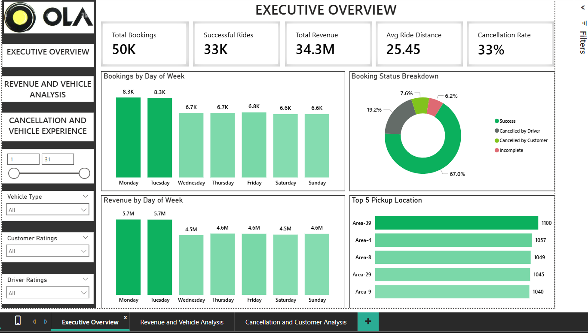
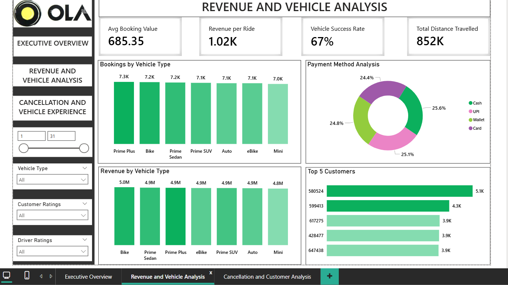

# OLA Bengaluru Ride Analytics Dashboard

This project is an interactive Power BI dashboard built to analyze OLA ride booking data for Bengaluru. The dashboard gives a clear view of bookings, revenue, ride success rate, cancellations, customer behavior, vehicle performance, and payment trends.

## Short Description

The OLA Bengaluru Dashboard is designed to understand how ride bookings are performing across different days, vehicle types, locations, customers, and cancellation categories. It helps identify revenue trends, operational issues, and areas where customer and driver experience can be improved.

## Business Problem

Ride-hailing companies handle thousands of bookings every day, but not all rides are completed successfully. Cancellations, incomplete rides, low vehicle performance, and customer experience issues can directly affect revenue and service quality.

This dashboard tries to answer key business questions such as:

- How many bookings are completed successfully?
- What is the overall cancellation rate?
- Which days generate the highest bookings and revenue?
- Which vehicle types perform better?
- Which pickup locations have the highest demand?
- What payment methods are most used by customers?
- How do customer and driver ratings affect ride performance?

## Tech Stack
- SQL
- Power BI Desktop
- Power Query
- DAX
- Data Modeling
- Excel / CSV dataset
- Data Visualization

## Why I Used These Tools

### Power BI Desktop
I used Power BI Desktop to build the complete dashboard because it is one of the most useful tools for business intelligence and data visualization. It helped me create interactive reports, KPI cards, slicers, charts, and dashboard pages in one place. Power BI also made it easy to connect the dataset, build relationships, create measures, and present the insights in a clean business format.

### Power Query
Power Query was used for cleaning and transforming the raw data before creating the dashboard. I used it to handle data types, remove unnecessary columns, check missing values, rename fields, and prepare the dataset for analysis. This step was important because clean data gives more accurate dashboard results.

### DAX
I used DAX to create calculated measures and KPIs that were required for analysis. Measures such as total bookings, successful rides, total revenue, average ride distance, cancellation rate, revenue per ride, and vehicle success rate were created using DAX. It helped me calculate business metrics dynamically based on filters and slicers.

### Data Modeling
Data modeling was used to structure the dataset properly so that the dashboard visuals could work correctly. It helped in organizing fields, creating relationships if required, and making the report easier to analyze. A good data model also improves dashboard performance and makes calculations more reliable.

### Excel / CSV Dataset
The dataset was available in Excel/CSV format, so I used it as the main data source for this project. Excel and CSV files are easy to import into Power BI and are commonly used for analytics projects. This format made it simple to load the booking data, clean it, and use it for creating insights.

### Data Visualization
Data visualization was used to present the analysis in an easy-to-understand way. Instead of showing only raw numbers, I used KPI cards, bar charts, donut charts, slicers, and tables to make the dashboard more interactive and useful. Visuals helped in quickly understanding booking trends, revenue performance, cancellation patterns, vehicle demand, and customer behavior.

## Data Source

The dataset used for this project contains OLA ride booking details for Bengaluru. It includes information such as booking status, revenue, ride distance, vehicle type, pickup location, payment method, customer ratings, driver ratings, and cancellation details.

## Dashboard Pages

### 1. Executive Overview

This page gives a high-level summary of the overall business performance.

Key metrics shown:

- Total Bookings: 50K
- Successful Rides: 33K
- Total Revenue: 34.3M
- Average Ride Distance: 25.45 km
- Cancellation Rate: 33%

It also includes booking trends by day, revenue by day, booking status breakdown, and top pickup locations.

### 2. Revenue and Vehicle Analysis

This page focuses on revenue performance and vehicle type analysis.

It includes:

- Average booking value
- Revenue per ride
- Vehicle success rate
- Total distance travelled
- Bookings by vehicle type
- Revenue by vehicle type
- Payment method analysis
- Top customers by revenue

### 3. Cancellation and Customer Analysis

This page is used to understand cancellation patterns and customer experience. It helps analyze which factors may be causing ride cancellations and how ratings are distributed across customers and drivers.

## Key Highlights

- Built a clean and interactive Power BI dashboard with multiple pages.
- Added slicers for vehicle type, customer ratings, driver ratings, and date range.
- Analyzed booking, revenue, cancellation, and vehicle performance trends.
- Used charts, KPI cards, donut charts, and bar visuals for better storytelling.
- Identified top-performing pickup locations and high-value customers.
- Compared booking and revenue performance across weekdays and vehicle types.

## Business Impact

This dashboard can help business teams:

- Track overall ride booking performance.
- Reduce cancellations by understanding cancellation patterns.
- Improve vehicle allocation based on demand and success rate.
- Identify high-demand pickup areas.
- Understand customer payment preferences.
- Improve customer and driver experience using rating-based insights.
- Make better decisions using data instead of assumptions.

## Project Outcomes

After building this dashboard, I was able to:

- Convert raw ride booking data into meaningful business insights.
- Create an end-to-end Power BI dashboard with interactive filters.
- Practice data cleaning, transformation, modeling, and visualization.
- Understand how ride-hailing business metrics are connected.
- Present data in a simple and business-friendly way.

## Conclusion

This project helped me understand how data analytics can be used in the ride-hailing industry. By analyzing bookings, revenue, cancellations, vehicle types, and customer behavior, the dashboard gives useful insights that can support better business decisions.
